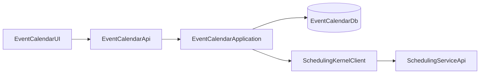

# EventCalendar Architecture

## Purpose

`EventCalendar` is a module-level backend that owns event metadata and delegates recurrence lifecycle operations to `SchedulingService`.

- EventCalendar owns event entity data (title, color, description, timezone, lifecycle status).
- SchedulingService owns recurrence definitions, split/override workflows, and occurrence expansion semantics.

## High-Level Diagram

## Data Ownership

### EventCalendar DB

- `CalendarEvents`
  - `Id` (GUID)
  - `Title`
  - `Description`
  - `Color`
  - `Timezone`
  - `IsActive`
  - `IsDeleted`
  - `ScheduleSyncStatus`
  - `ModuleType` (fixed `Event`)
  - `ModuleEntityId` (same as event id)
  - timestamps

### SchedulingService DB

- schedule definitions and lineages
- occurrence overrides
- policy artifacts (holiday/blackout)

## Integration Style

- EventCalendar uses a typed HTTP client (`ISchedulingKernelClient`) to call SchedulingService endpoints.
- Create/update/delete event workflows are orchestration-based with eventual consistency.
- No distributed transaction is used.

## Reliability

- Retry with jitter for retryable SchedulingService failures (5xx / timeout / 429).
- Event marked `Pending` when scheduling operation fails and requires reconciliation.

## Evolution Notes

- Demo mode currently runs without JWT auth.
- API and service boundaries are ready for adding JWT tenant/user claims later.
