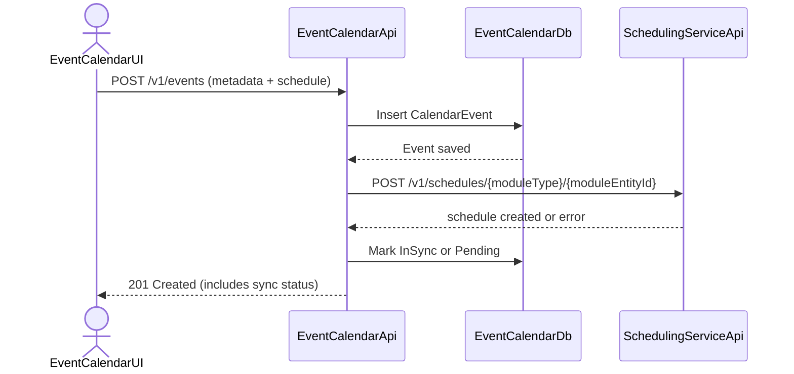
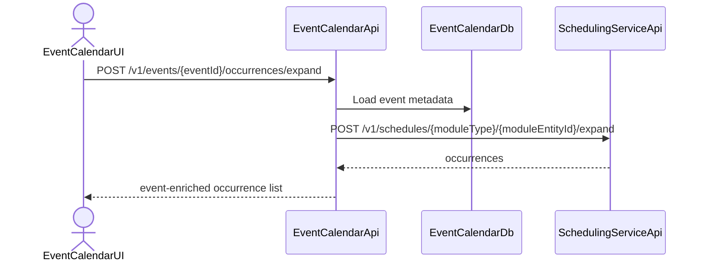
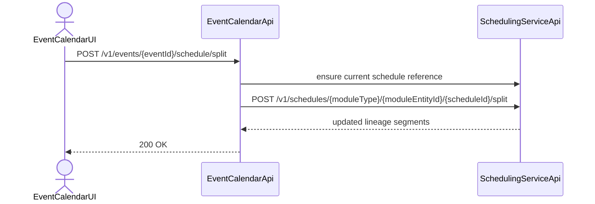

# EventCalendar Sequence Flows

## Create Event With Schedule

```mermaid
sequenceDiagram
  actor UI as EventCalendarUI
  participant API as EventCalendarApi
  participant DB as EventCalendarDb
  participant SK as SchedulingServiceApi

  UI->>API: POST /v1/events (metadata + schedule)
  API->>DB: Insert CalendarEvent
  DB-->>API: Event saved
  API->>SK: POST /v1/schedules/{moduleType}/{moduleEntityId}
  SK-->>API: schedule created or error
  API->>DB: Mark InSync or Pending
  API-->>UI: 201 Created (includes sync status)
```

## Expand Occurrences

```mermaid
sequenceDiagram
  actor UI as EventCalendarUI
  participant API as EventCalendarApi
  participant DB as EventCalendarDb
  participant SK as SchedulingServiceApi

  UI->>API: POST /v1/events/{eventId}/occurrences/expand
  API->>DB: Load event metadata
  API->>SK: POST /v1/schedules/{moduleType}/{moduleEntityId}/expand
  SK-->>API: occurrences
  API-->>UI: event-enriched occurrence list
```

## Split Schedule

```mermaid
sequenceDiagram
  actor UI as EventCalendarUI
  participant API as EventCalendarApi
  participant SK as SchedulingServiceApi

  UI->>API: POST /v1/events/{eventId}/schedule/split
  API->>SK: ensure current schedule reference
  API->>SK: POST /v1/schedules/{moduleType}/{moduleEntityId}/{scheduleId}/split
  SK-->>API: updated lineage segments
  API-->>UI: 200 OK
```
