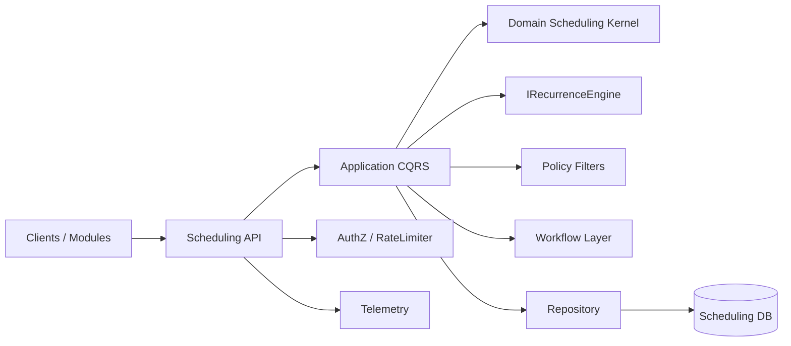
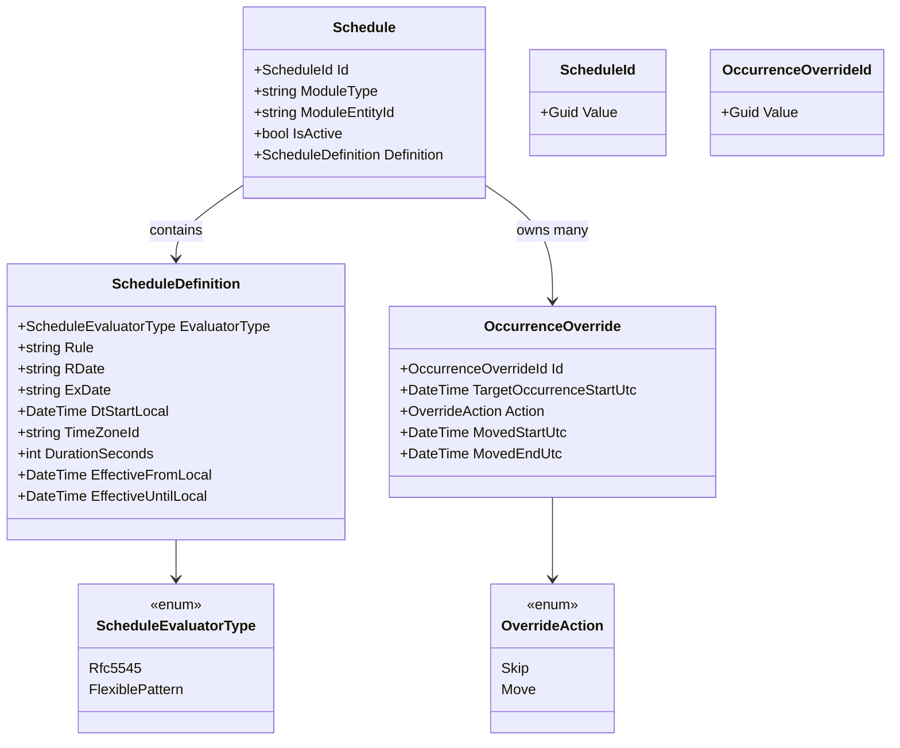
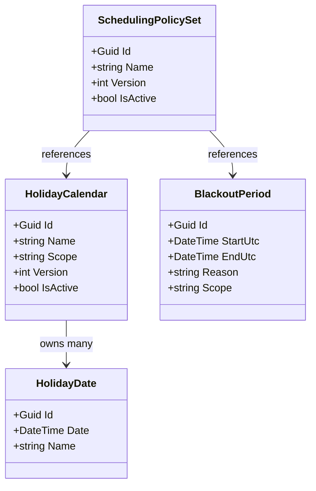
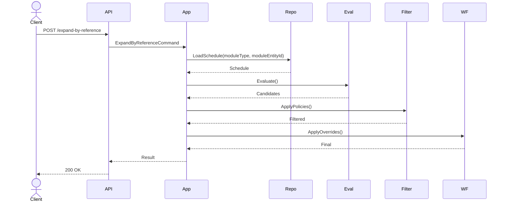

# SPEC-1-Scheduling Kernel Service

## Background

We are introducing a backend **Scheduling Kernel Service** as a **platform-level microservice** that centralizes scheduling semantics, recurrence evaluation, shared scheduling capabilities, and reusable policy artifacts across multiple product domains.

Goals:
- eliminate duplicated scheduling logic across modules
- ensure consistent, timezone-aware occurrence generation
- reduce onboarding and maintenance cost
- enable independent evolution of scheduling
- provide a foundation for policy and workflow layers

The system separates scheduling into three stages:

1. **Evaluator** – generates candidate occurrences (RFC 5545 initially)
2. **Filter** – applies policies (holiday, blackout, exclusions)
3. **Workflow** – lifecycle operations (split, stale detection, recalculation)

MVP focuses on recurrence evaluation; architecture supports future extension.

**Assumptions**
- Multi-tenant at application level
- Timezones are IANA; outputs are UTC
- SECONDLY/MINUTELY not supported (MVP)
- Service owns scheduling persistence by default
- Modules integrate via API (eventual consistency)

---

## Backbone Principles

1. **Platform Microservice Ownership**  
Scheduling is an independently deployable microservice with its own API and persistence.

2. **RFC 5545 as First Evaluator**  
Frontend uses `rrule.js`, backend uses `Ical.Net`. No custom recurrence math.

3. **Extensible Evaluator Model**  
Additional evaluator types can be introduced without breaking the core model.

4. **Centralized Persistence (Adopted)**  
Scheduling data is owned by the service to enable centralized schema evolution and consistent semantics.

5. **Eventual Consistency**  
Module ↔ Scheduling interactions are eventually consistent by default; APIs must be idempotent and retry-safe.

6. **Policy Separation**  
Policies (holiday, blackout, constraints) are applied post-evaluation as filters.

7. **Parity Testing**  
`rrule.js` and `Ical.Net` must remain aligned via golden vectors.

8. **Controlled Feature Surface**  
Unsupported or unstable features are rejected via validation.

9. **Deployment Flexibility**  
Multiple deployment topologies are supported (shared, isolated, colocated).

---

## UI Component Strategy

A shared **Scheduling UI Component** will be developed and reused across multiple screens and modules.

### Purpose
- provide a consistent user experience for building and editing schedules
- prevent each module from inventing its own recurrence UI
- keep frontend authoring aligned with backend contract

### Responsibilities
- compose RFC 5545 rules using `rrule.js`
- preview occurrences locally for user feedback
- emit backend-compatible payloads:
  - `evaluatorType`
  - `rrule`
  - `rdate`
  - `exdate`
  - `dtstart`
  - `timezone`
  - `durationSeconds`

### Architectural Role
The UI component is part of the scheduling platform capability and should be packaged for reuse across modules and screens.

### Benefits
- consistent recurrence authoring experience
- reduced duplicated UI logic
- lower integration cost for new modules
- stronger parity between frontend rule composition and backend evaluation

### Testing Expectations
- component-level tests for rule composition
- golden-vector parity checks against backend-supported cases
- integration tests with typed API client

---

## Requirements

### Data Contract (MVP)
- RFC strings: `RRULE` (required), `RDATE` (optional), `EXDATE` (optional)
- `dtstart` (local), `timezone` (IANA), optional `durationSeconds` / `dtend`
- `evaluatorType`
- `moduleType`
- `moduleEntityId`

### Core API Requirements
- create or replace a persisted schedule by `(moduleType, moduleEntityId)`
- fetch a persisted schedule by `(moduleType, moduleEntityId)`
- delete a persisted schedule by `(moduleType, moduleEntityId)`
- validate a schedule definition without persisting
- expand by reference using `(moduleType, moduleEntityId)`
- expand by definition using direct RFC payload for preview / validation scenarios

---

## Method

### Architecture Overview
- Clean Architecture (.NET): `API -> Application -> Domain -> Infrastructure`
- Pipeline: **Evaluator -> Filter -> Workflow**
- Persistence: owned by Scheduling Service
- Security: JWT bearer, per-entity authorization, rate limiting

---

## High-Level Component Diagram


---

## API Surface (v1)

**PUT /v1/schedules/{moduleType}/{moduleEntityId}** – create or replace a persisted schedule
```json
{
  "evaluatorType": "Rfc5545",
  "rrule": "FREQ=WEEKLY;INTERVAL=2;BYDAY=MO,WE",
  "rdate": "20260122T090000,20260201T090000",
  "exdate": "20260215T090000",
  "dtstart": "2026-01-20T09:00:00",
  "timezone": "America/Los_Angeles",
  "durationSeconds": 3600,
  "isActive": true
}
```

**GET /v1/schedules/{moduleType}/{moduleEntityId}** – fetch persisted schedule

**DELETE /v1/schedules/{moduleType}/{moduleEntityId}** – delete persisted schedule

**POST /v1/schedules/validate** – validate a definition without persisting
```json
{
  "evaluatorType": "Rfc5545",
  "rrule": "FREQ=WEEKLY;INTERVAL=2;BYDAY=MO,WE",
  "rdate": "20260122T090000,20260201T090000",
  "exdate": "20260215T090000",
  "dtstart": "2026-01-20T09:00:00",
  "timezone": "America/Los_Angeles",
  "durationSeconds": 3600
}
```

**POST /v1/schedules/expand-by-definition** – expand a direct definition without persisting
```json
{
  "schedule": {
    "evaluatorType": "Rfc5545",
    "rrule": "FREQ=WEEKLY;INTERVAL=2;BYDAY=MO,WE",
    "rdate": "20260122T090000,20260201T090000",
    "exdate": "20260215T090000",
    "dtstart": "2026-01-20T09:00:00",
    "timezone": "America/Los_Angeles",
    "durationSeconds": 3600
  },
  "rangeStartUtc": "2026-01-01T00:00:00Z",
  "rangeEndUtc": "2026-03-01T00:00:00Z",
  "maxOccurrences": 500,
  "pageSize": 100,
  "cursor": null,
  "appliedPolicyIds": ["holiday-us", "blackout-program-a"]
}
```

**POST /v1/schedules/expand-by-reference** – expand a persisted schedule by module reference
```json
{
  "moduleType": "Task",
  "moduleEntityId": "7f1f2f0b-1b34-4c5a-bdb4-d6620ad7b0d9",
  "rangeStartUtc": "2026-01-01T00:00:00Z",
  "rangeEndUtc": "2026-03-01T00:00:00Z",
  "maxOccurrences": 500,
  "pageSize": 100,
  "cursor": null,
  "appliedPolicyIds": ["holiday-us", "blackout-program-a"]
}
```

**Response**
```json
{
  "occurrences": [
    {
      "moduleType": "Task",
      "moduleEntityId": "7f1f2f0b-1b34-4c5a-bdb4-d6620ad7b0d9",
      "startUtc": "2026-01-20T17:00:00Z",
      "endUtc": "2026-01-20T18:00:00Z"
    }
  ],
  "nextCursor": "..."
}
```

---

## Domain Model

### Core Types
- **Schedule** (Entity)
- **ScheduleDefinition** (Value Object)
- **OccurrenceOverride** (Entity)
- **ScheduleId / OccurrenceOverrideId** (Strong IDs)

### Class Diagram – Scheduling Domain


---

## Persistence Strategy (Adopted – Proposal B)

The Scheduling Service **owns all scheduling persistence**:
- schedules
- recurrence rules
- overrides
- policy artifacts

Each schedule is keyed by:
- `moduleType`
- `moduleEntityId`

Modules:
- interact via API
- do not persist scheduling data

### Tradeoffs

**Benefits**
- centralized schema evolution
- consistent semantics
- lower onboarding cost
- reduced duplication
- lower risk of compatibility drift across modules

**Costs**
- eventual consistency
- cross-service coordination

### Clarification
Using the same database only guarantees consistency if operations share the same transaction boundary. Separate services using the same DB do not automatically provide ACID consistency.

---

## Deployment Flexibility

### 1. Shared Platform Mode
- multiple modules share one service + DB
- cost-efficient
- requires isolation (rate limiting, quotas)

### 2. Isolated Module Mode
- one module per service instance
- dedicated DB
- avoids noisy-neighbor impact

### 3. Colocated Mode
- service deployed near module
- may use same DB instance (separate schema recommended)
- improves coordination where required

---

## Policy Model (Future)

- HolidayCalendar
- HolidayDate
- BlackoutPeriod
- SchedulingPolicySet

### Class Diagram – Policy Artifacts


---

## Validation Rules
- Parse RFC using `Ical.Net`; reject on failure
- Disallow SECONDLY/MINUTELY
- Enforce `maxOccurrences` and `maxRangeDays`
- Canonicalize strings via library
- Deduplicate `RDATE`/`EXDATE`

---

## Expansion Algorithm
1. Evaluate via selected evaluator
2. Generate candidate occurrences in `[start, end)`
3. Apply policy filters (holiday, blackout, exclusions)
4. Apply overrides
5. Return ordered, unique UTC intervals

### Sequence Diagram – Expand By Reference


---

## Concerns & Decisions (Q&A)

### Transactional Consistency
**Decision:** Accept eventual consistency
- requires idempotent create/update calls
- requires retries and reconciliation
- reference-based expansion reads persisted schedules from scheduling DB

### Noisy Neighbor Risk
**Decision:** Support isolated deployments

### Module Maintenance Cost (Alternative A)
**Observation:** Module-owned persistence increases onboarding, migration coordination, and drift risk
**Decision:** Centralize persistence

### Shared vs Dedicated Instances
**Decision:** Support both modes

### Database Flexibility
**Decision:** Support relational providers (PostgreSQL, SQL Server). Non-relational stores require explicit implementation.

---

## ADR

**Title:** Scheduling as Platform Microservice with Centralized Persistence

**Context:** Scheduling spans multiple modules and will evolve

**Decision:**
- Independent microservice
- Centralized persistence
- Eventual consistency
- Flexible deployment modes

**Alternatives:**
- Module-owned persistence: strong local consistency, high maintenance cost

**Consequences:**
- (+) centralized evolution, consistency, lower onboarding cost
- (-) eventual consistency, requires retry/reconciliation patterns

---

## Final Assessment

This architecture prioritizes platform scalability and evolvability over strict local consistency, while providing deployment flexibility to mitigate operational risks.

